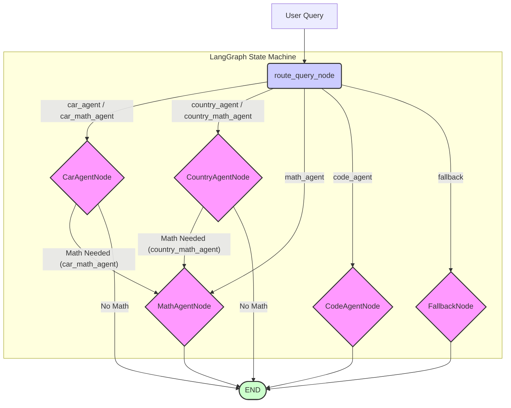

# System Design and Code Flow

This document outlines the architecture and interaction flow of the RAG (Retrieval-Augmented Generation) Bot.

## 1. Overall LangGraph Workflow

The core of the application is an agentic workflow managed by LangGraph. The `agent_orchestrator_chat` function in `src/main.py` initializes and runs this graph.



**Explanation:**

1.  **User Query**: The process starts with a user's query.
2.  **`route_query_node`**:
    *   Receives the current `GraphState` (query, history, etc.).
    *   Utilizes the `Router` class to determine the `next_agent_operation`.
    *   Updates the `GraphState` with the routing decision.
3.  **Conditional Edges**: Based on `next_agent_operation`:
    *   If "car\_agent" or "car\_math\_agent": Transitions to `CarAgentNode`.
    *   If "country\_agent" or "country\_math\_agent": Transitions to `CountryAgentNode`.
    *   If "math\_agent": Transitions to `MathAgentNode`.
    *   If "code\_agent": Transitions to `CodeAgentNode`.
    *   If "fallback": Transitions to `FallbackNode`.
    *   If "math\_on\_car\_output" or "math\_on\_country\_output" (internal states set by Car/Country agents): Transitions to `MathAgentNode`.
4.  **Agent Nodes (`CarAgentNode`, `CountryAgentNode`, `MathAgentNode`, `CodeAgentNode`, `FallbackNode`)**:
    *   Each node executes its respective agent's logic.
    *   `CarAgentNode` and `CountryAgentNode` can set `next_agent_operation` to trigger the `MathAgentNode` if a follow-up mathematical calculation is needed on their retrieved data.
    *   They update the `GraphState` with the `result` (and potentially `intermediate_data_for_math`).
5.  **END**: Most agent nodes transition to `END` after execution, unless a specific chained operation (like car -> math) is determined.

## 2. Router Logic (`src/utilities/router.py`)

The `Router` class classifies the user query to determine the appropriate agent or agent combination.

```mermaid
graph TD
    R_A[User Query] --> R_B{Router.route()};
    R_B -- Similarity Search against Routing Examples --> R_C{Filtered Few-Shot Examples};
    R_C -- Form Prompt with Examples and Query --> R_D{LLM (gpt-3.5-turbo)};
    R_D -- Classification --> R_E{Route Decision (e.g., car_agent, math_agent)};
    R_E -- Validate Response --> R_F[Return Validated Route Label];

    classDef routerInternal fill:#ccf,stroke:#333,stroke-width:1px;
    class R_B,R_C,R_D,R_E routerInternal;
```
**Explanation:**
1.  The `Router.route(query)` method is called.
2.  It performs a similarity search using `routing_vectorstore` (loaded by `load_routing_vectorstore`) to find relevant examples for few-shot prompting.
3.  A prompt is constructed using these examples and the user's query.
4.  The prompt is sent to an LLM (`gpt-3.5-turbo`) for classification.
5.  The LLM's response (the route label) is validated against a predefined set of valid routes.
6.  The validated route label is returned.

## 3. Car Agent Logic (`src/utilities/car_agent.py`)

The `CarAgent` class handles queries related to car data.

```mermaid
graph TD
    CA_A[Query from GraphState] --> CA_B{CarAgent.run()};
    CA_B --> CA_C{refine_query (currently returns original)};
    CA_C --> CA_D{extract_filter_criteria (RegEx)};
    CA_D -- Potentially with Filters --> CA_E{vector_store.similarity_search (FAISS)};
    CA_E -- Retrieved Documents --> CA_F{Format Context};
    CA_F --> CA_G{RetrievalQA.from_chain_type (LLM with Context)};
    CA_G -- Answer --> CA_H[Return Result to GraphState];

    classDef carAgentInternal fill:#f9f,stroke:#333,stroke-width:1px;
    class CA_B,CA_C,CA_D,CA_E,CA_F,CA_G carAgentInternal;
```

**Explanation:**
1.  The `CarAgent.run(query)` method is invoked by the LangGraph node.
2.  `refine_query`: (Currently a placeholder, returns the query as is).
3.  `extract_filter_criteria`: Uses regular expressions to attempt to extract filters (make, model, year) from the query.
4.  `vector_store.similarity_search`: Retrieves relevant documents from the FAISS `car_vector_db`. If filters were extracted, they are applied here.
5.  The retrieved documents are formatted into a single `context` string.
6.  A `RetrievalQA` chain (using an LLM and the FAISS retriever) is invoked with the `query` and `context` to generate an answer.
7.  The final answer is returned and updated in the `GraphState`.

## 4. Country Agent Logic (`src/utilities/country_agent.py`)

The `CountryAgent` class handles queries related to country data using a LangChain Expression Language (LCEL) chain.

```mermaid
graph TD
    CoA_A[Query from GraphState] --> CoA_B{CountryAgent.run()};
    CoA_B -- Invoke LCEL Chain --> CoA_C{LCEL Chain Execution};
    CoA_C --> CoA_D{vector_store.as_retriever()};
    CoA_D -- Retrieved Documents --> CoA_E{retrieve_and_print (Formats Context)};
    CoA_E --> CoA_F{PromptTemplate (with Context & Question)};
    CoA_F --> CoA_G{LLM (gpt-3.5-turbo)};
    CoA_G -- Parsed Answer --> CoA_H[Return Result to GraphState];

    subgraph LCEL Chain
        CoA_D --> CoA_E;
        CoA_E --> CoA_F;
        CoA_F --> CoA_G;
    end

    classDef countryAgentInternal fill:#f9f,stroke:#333,stroke-width:1px;
    class CoA_B, CoA_C countryAgentInternal;
```

**Explanation:**
1.  The `CountryAgent.run(query)` method is invoked.
2.  It directly invokes its pre-configured LCEL chain.
3.  **LCEL Chain Steps**:
    *   The `vector_store.as_retriever()` fetches relevant documents from `country_vector_db`.
    *   `retrieve_and_print` (a `RunnableLambda`) formats these documents into a context string.
    *   The context and original query are passed to a `PromptTemplate`.
    *   The formatted prompt is sent to the LLM.
    *   `StrOutputParser` extracts the string result.
4.  The final answer is returned.

## 5. Math Agent Logic (`src/utilities/math_agent.py`)

The `run_math_agent` function handles mathematical calculations.

```mermaid
graph TD
    MA_A[Query/Prompt from GraphState] --> MA_B{run_math_agent()};
    MA_B --> MA_C{create_math_agent_chain()};
    MA_C --> MA_D{LLMMathChain (LLM + Python REPL)};
    MA_D -- Invoke with Query --> MA_E[Return Numerical Result/Explanation];

    classDef mathAgentInternal fill:#f9f,stroke:#333,stroke-width:1px;
    class MA_B,MA_C,MA_D mathAgentInternal;
```

**Explanation:**
1.  The `run_math_agent(prompt)` function is called. The prompt might be the original user query or a derived query (e.g., "Based on data X, calculate Y").
2.  `create_math_agent_chain()`: Initializes an `LLMMathChain`. This chain uses an LLM to understand the math problem and Python to execute it.
3.  The `LLMMathChain` is invoked with the prompt.
4.  The result (numerical answer or an explanation if it couldn't compute) is returned.

## 6. Code Agent Logic (`src/utilities/code_agent.py`)

The `run_code_agent` function generates and executes Python code for various tasks, including statistical analysis and visualizations.

```mermaid
graph TD
    CDA_A[Prompt from GraphState] --> CDA_B{run_code_agent()};
    CDA_B --> CDA_C{get_hashed_filename (for caching)};
    CDA_C -- Check if script exists --> CDA_D{Script Cached?};
    CDA_D -- Yes --> CDA_G{execute_generated_code()};
    CDA_D -- No --> CDA_E{generate_python_code (LLM: gpt-3.5-turbo)};
    CDA_E -- Generated Python Code --> CDA_F{save_python_script()};
    CDA_F --> CDA_G;
    CDA_G -- Script Output (stdout/stderr) / Path to Visualization --> CDA_H[Return Result/Path];

    classDef codeAgentInternal fill:#f9f,stroke:#333,stroke-width:1px;
    class CDA_B,CDA_C,CDA_D,CDA_E,CDA_F,CDA_G codeAgentInternal;
```

**Explanation:**
1.  The `run_code_agent(prompt)` function is called.
2.  `get_hashed_filename`: Creates a unique filename based on the prompt hash for caching purposes.
3.  **Caching**:
    *   If a script with this filename already exists, it skips generation.
4.  **Code Generation (if not cached)**:
    *   `generate_python_code(prompt)`: Sends the prompt to `gpt-3.5-turbo` (with specific system instructions to return only Python code and use provided data sources if relevant).
    *   `save_python_script()`: Saves the generated code to the hashed filename in the `src/utilities/math_scripts` directory.
5.  `execute_generated_code(script_path)`:
    *   Runs the Python script using `subprocess.run()`.
    *   Captures `stdout` and `stderr`.
6.  The output from the script (or an error message, or potentially a path to a generated visualization file) is returned.

This outlines the primary flows within the system. The interaction between these components allows the RAG bot to handle diverse queries effectively. 